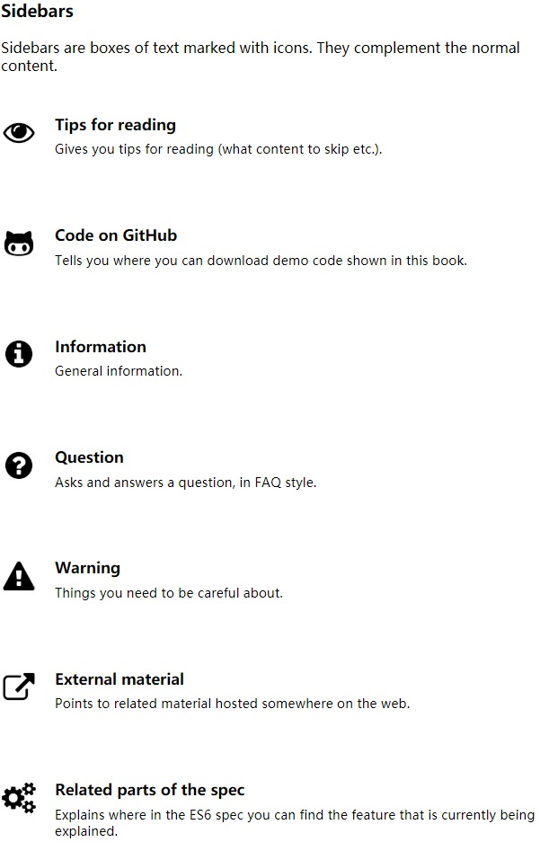

# Exploring ES6

ES6 的学习笔记，主要是翻译了[Dr. Axel Rauschmayer](https://twitter.com/rauschma)的这本书 —— [Exploring ES6][exploring-es6] 。有能力的同学可以[购买](https://leanpub.com/exploring-es6/)或者[捐助](http://www.2ality.com/p/donate.html)支持一下原书作者。

[exploring-es6]: http://exploringjs.com/es6/index.html

如果涉及到任何版权问题，请尽早[联系我](mailto:herbert9988@163.com)，谢谢。

注：

- 用({{ ... }})包裹起来的内容，在原书中是没有的。这些是我自己添加的一些扩展内容，主要是一些追加的原因解释或扩展的例子等内容。
- 专业术语和重要的名词首次出现时会在括号里写明英文原词，方便和其他英文材料对照，如果有更好的中文翻译也方便修改。
- 代码中的异常提示信息是在 Chrome 浏览器中得到的，不同的浏览器可能略有不同。
- 个别暂时无法翻译（因为翻译能力所限或者原理理解不了等原因）的内容保持英文原样内容。
- 原书的 [侧边栏(sidebar)](http://exploringjs.com/es6/ch_about-book.html#_sidebars) 是用图标表示的，考虑到博客系统的兼容性和可移植性，这里用文本替换。

  

  映射表如下:

  | Icon                      | Text         |
  | ------------------------- | ------------ |
  | Tips for reading          | **_[TIPS]_** |
  | Code on GitHub            | **_[GIT]_**  |
  | Information               | **_[INFO]_** |
  | Question                  | **_[QUES]_** |
  | Warning                   | **_[WARN]_** |
  | External material         | **_[MATE]_** |
  | Related parts of the spec | **_[SPEC]_** |
