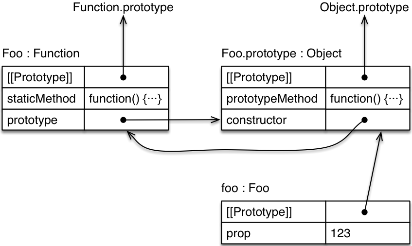

# Chapter 15: 类(Classes)

## 15.1 概览

类和子类：

```javascript
class Point {
  constructor(x, y) {
    this.x = x;
    this.y = y;
  }
  toString() {
    return `(${this.x}, ${this.y})`;
  }
}

class ColorPoint extends Point {
  constructor(x, y, color) {
    super(x, y);
    this.color = color;
  }
  toString() {
    return super.toString() + " in " + this.color;
  }
}
```

使用类：

```javascript
const cp = new ColorPoint(25, 8, "green");
cp.toString(); // => "(25, 8) in green"
cp instanceof ColorPoint; // => true
cp instanceof Point; // => true
```

实际上，ES6 类并不是一个全新的东西：它主要提供更加便利的语法糖来创建旧式构造函数。如果你使用 _typeof_ 运算符，你将看到：

```javascript
typeof Point; // => function
```

## 15.2 要点

### 15.2.1 类的基础知识

ES6 中定义的类看起来像这样：

```javascript
class Point {
  constructor(x, y) {
    this.x = x;
    this.y = y;
  }
  toString() {
    return `(${this.x}, ${this.y})`;
  }
}
```

你可以像 ES5 构造函数一样来使用类：

```javascript
var p = new Point(25, 8);
p.toString(); // => (25, 8)
```

实际上，一个类定义的结果就是一个函数：

```javascript
typeof Point; // => function
```

然而，你只能通过 _new_ 来调用类，而不能通过普通函数调用（原因稍后解释）：

```javascript
// Uncaught TypeError:
// Class constructor Point cannot be invoked without 'new'
Point();
```

**_[SPEC]_** - 在规范中，函数对象的内部方法 [[[call]]][function.call] 阻止了类作为函数调用。

[function.call]: http://www.ecma-international.org/ecma-262/6.0/#sec-ecmascript-function-objects-call-thisargument-argumentslist

#### 15.2.1.1 类定义的成员之间没有分隔符

类定义的成员之间没有分隔标点符号。譬如，对象字面量的成员之间是通过逗号分隔的，但是这在类定义的最顶层是非法的。分号是允许的，但它们会被忽略：

```javascript
class MyClass {
    foo() {}
    ; // OK, 被忽略
    , // 语法错误
    bar() {}
}
```

允许使用分号是为将来的语法做预备，未来可能包含以分号结束的类成员。禁止逗号是为了强调类定义不同于对象字面量。

#### 15.2.1.2 类定义不会提前(hoisted)

函数声明将被 [提前(Hoisting)][hoisting] ：当进入一块作用域，其中声明的函数立即变得可用——无论你在何处定义它们。这意味着你可以在函数定义之前调用它们：

[hoisting]: https://developer.mozilla.org/en-US/docs/Glossary/Hoisting

```javascript
foo(); // 正常运行，因为"foo"被提前
function foo() {}
```

与上述不同，类定义不会被提前。因此，只有当执行到类定义处并对其求值(evaluate)后，这个类才存在。过早访问它将引发 ReferenceError。

```javascript
// Uncaught ReferenceError:
// Cannot access 'Foo' before initialization
new Foo();
class Foo {}
```

有这种限制的原因是：类可以有一个 extends 子句，其值是任意表达式。该表达式必须在适当“位置”求值，它无法被提前。

这种限制并不是那么严格。例如，在类声明之前的函数仍然可以引用该类，但是你必须等到类声明并被求值之后才能调用该函数。

```javascript
function functionThatUsesBar() {
  new Bar();
}
functionThatUsesBar(); // ReferenceError
class Bar {}
functionThatUsesBar(); // OK
```

#### 15.2.1.3 类表达式

与函数类似，定义类也有两种方式：_类声明(class declarations)_ 和 _类表达式(class expressions)_ 。

与函数表达式类似，类表达式也可以是匿名的：

```javascript
const MyClass = class {
  // ...
};
const inst = new MyClass();
```

同样，类表达式也可以有仅其内部可见的名称。

```javascript
const MyClass = class Me {
  getClassName() {
    return Me.name;
  }
};
const inst = new MyClass();
// ReferenceError: Me is not defined
const inst2 = new Me();

console.log(inst.getClassName()); // Me
// ReferenceError: Me is not defined
console.log(Me.name);
```

最后两行表明，Me 不是类外部的变量，但可以在类内部使用它。

### 15.2.2 类的主体(body)

类的主体只能包含方法，不能有数据属性。原型(prototypes)中有数据属性通常被认为是一种反模式(anti-pattern)，所以这只是一种强制推行的最佳实践。

#### 15.2.2.1 构造函数，静态方法，原型方法

我们先来看一下你经常可以在类定义中看到的三类方法。

```javascript
class Foo {
  constructor(prop) {
    this.prop = prop;
  }
  static staticMethod() {
    return "classy";
  }
  prototypeMethod() {
    return "prototypical";
  }
}

const foo = new Foo(123);
```

该类定义的对象图(object diagram)如下所示：[[Prototype]]表示对象间的继承关系，而 prototype 是一个普通属性，它的值是一个对象。只有当 new 运算符使用其值作为新创建实例的原型时，prototype 属性才具有特殊意义。



首先，伪方法(pseudo-method) _constructor_。这是一个特殊的方法，它定义了代表类的函数。

```javascript
Foo === Foo.prototype.constructor; // => true
typeof Foo; // => function
```

它有时也被称为类构造函数(class constructor)。它具有普通构造函数所没有的功能（主要是指它可以通过 _super()_ 来调用超类构造函数，这点稍后再解释）。

其次，静态方法。静态属性（或类属性）是 _Foo_ 自身的属性。如果你给一个方法定义加上 _static_ 前缀，你就创建了一个类方法：

```javascript
typeof Foo.staticMethod; // => function
Foo.staticMethod(); // => classy
```

最后，原型方法。Foo 的原型属性是 _Foo.prototype_ 对象的属性。它们通常是方法，并且可以被 Foo 类的实例继承。

```javascript
typeof Foo.prototype.prototypeMethod; // => function
Foo.prototype.prototypeMethod(); // => prototypical
foo.prototypeMethod(); // => prototypical
```

#### 15.2.2.2 静态数据属性

为了按时完成 ES6 类，它们被故意设计成“最大程度最小化”(maximally minimal)。这就是为什么你现在只能创建静态方法、getters 和 setters，但不能创建静态数据属性。现在已有提案(proposal)将它们加入到语言中。直到该提案被接受之前，你可以使用两种变通方案。

方案一：你可以手动添加一个静态属性。

```javascript
class Point {
  constructor(x, y) {
    this.x = x;
    this.y = y;
  }
}

Point.ZERO = new Point(0, 0);
```

你可以使用 Object.defineProperty()来创建一个只读属性，但是我喜欢更简单的直接赋值方式。

方案二：你可以创建一个静态 getter：

```javascript
class Point {
  constructor(x, y) {
    this.x = x;
    this.y = y;
  }
  static get ZERO() {
    return new Point(0, 0);
  }
}

Point.ZERO; // => Point {x: 0, y: 0}
```

通过这两种方法，你都可以得到一个可读取的 Point.ZERO 属性。第一种方案中，每次返回的都是同一个实例对象。而在第二种方案中，每次都将返回一个新创建的实例对象。

#### 15.2.2.3 Getters 和 Setters

getter 和 setter 的语法和[它们在 ES5 对象字面量中的语法](http://speakingjs.com/es5/ch17.html#getters_setters)一样:

```javascript
class MyClass {
  get prop() {
    return "getter";
  }
  set prop(value) {
    console.log("setter: " + value);
  }
}
```

你可以像下面这样使用 MyClass:

```javascript
const inst = new MyClass();
inst.prop = 123; // => setter: 123
inst.prop; // => getter
```

#### 15.2.2.4 可计算的方法命名(computed method names)

你可以在方括号中使用表达式来定义方法名称。例如，下面几种方式定义的 Foo 是等价的。

```javascript
class Foo {
  myMethod() {}
}

class Foo {
  ["my" + "Method"]() {}
}

const m = "myMethod";
class Foo {
  [m]() {}
}
```

ES6 中几个特殊方法的 keys 是 symbols。可计算的方法命名允许你定义这样的方法。例如，如果一个对象有一个方法的 key 是 [Symbol.iterator](https://developer.mozilla.org/en-US/docs/Web/JavaScript/Reference/Global_Objects/Symbol/iterator)，那么它就是可迭代的(iterable)。这意味着它的内容可以通过 for-of 循环及其他语言机制来进行迭代。

```javascript
class IterableClass {
  [Symbol.iterator]() {
    // ...
  }
}
```

#### 15.2.2.5 生成器方法

如果你为一个方法定义添加星号(\*)前缀，它就变成一个 _生成器方法(generator method)_。对于其 key 为 Symbol.iterator 的方法来说，生成器方法非常有用。以下代码展示了它的工作方式：

```javascript
class IterableArguments {
  constructor(...args) {
    this.args = args;
  }

  *[Symbol.iterator]() {
    for (const arg of this.args) {
      yield arg;
    }
  }
}

for (const x of new IterableArguments("hello", "world")) {
  console.log(x);
}
// Output:
// hello
// world
```

### 15.2.3 子类

通过 extends 子句，你可以创建一个现有构造函数（是否通过 class 定义都可以）的子类：

```javascript
class Point {
  constructor(x, y) {
    this.x = x;
    this.y = y;
  }
  toString() {
    return `(${this.x}, ${this.y})`;
  }
}

class ColorPoint extends Point {
  constructor(x, y, color) {
    super(x, y); // (A)
    this.color = color;
  }
  toString() {
    return super.toString() + " in " + this.color; // (B)
  }
}
```

这个类的使用方式如下：

```javascript
const cp = new ColorPoint(25, 8, "green");
cp.toString(); // => (25, 8) in green

cp instanceof ColorPoint; // => true
cp instanceof Point; // => true
```

这里有两种类：

- Point 是基类(base class)，因为它没有 extends 子句。
- ColorPoint 是一个派生类(derived class)。

_super_ 有两种用法：

- 类构造函数（类定义中的伪方法 constructor）：像函数调用一样使用它——super(...)，是为了调用超类构造函数（行 A）。
- 方法定义（在对象字面量或类中，使不使用 _static_ 均可）：像属性引用（super.prop）或方法调用（super.method(...)）一样使用它，是为了引用超类的属性或方法（行 B）。

#### 15.2.3.1 子类的原型对象是超类

ES6 中，一个子类的原型对象是它的超类：

```javascript
Object.getPrototypeOf(ColorPoint) === Point;
// => true
```

这意味着超类的静态属性是可继承的。

```javascript
class Foo {
  static classMethod() {
    return "hello";
  }
}

class Bar extends Foo {}
Bar.classMethod(); // => hello
```

你甚至可以在子类中调用超类的静态方法：

```javascript
class Foo {
  static classMethod() {
    return "hello";
  }
}

class Bar extends Foo {
  static classMethod() {
    return super.classMethod() + ", too";
  }
}
Bar.classMethod(); // => hello, too
```

#### 15.2.3.2 超类构造函数调用

在派生类中，在你使用 this 之前，必须先调用 super()。

```javascript
class Foo {}
class Bar extends Foo {
  constructor(num) {
    const tmp = num * 2; // OK

    // Uncaught ReferenceError:
    // Must call super constructor in derived class
    // before accessing 'this' or
    // returning from derived constructor
    this.num = num; // (A)

    super();
    this.num = num; // OK
  }
}
new Bar(123); // 行A处将引发ReferenceError
```

隐式退出派生类的构造函数而不调用 super()也会导致一个错误：

```js
class Foo {}
class Bar extends Foo {
  constructor() {}
}
new Bar(); // => ReferenceError
```

({{ 有上述两种限制的原因，是为了避免 this 中的属性或方法未被正确初始化。 }})

#### 15.2.3.3 重写构造函数的结果

和 ES5 一样，你可以通过显式返回一个对象来重写构造函数的结果：

```javascript
class Foo {
  constructor() {
    return Object.create(null);
  }
}

console.log(new Foo() instanceof Foo);
// => false
```

如果你这样做，this 是否被初始化都不重要。也就是说，如果用这种方式重写返回结果，你无需在派生类构造函数中调用 super()。

#### 15.2.3.4 类的默认构造函数

如果你没有为基类指定构造函数，将使用下面的定义：

```javascript
constructor() {}
```

对于派生类，将使用以下默认定义：

```javascript
constructor(...args) {
  super(...args)
}
```

#### 15.2.3.5 内置构造函数的子类化

ES6 中，你终于可以子类化所有的内置构造函数（[ES5 有解决方法](http://speakingjs.com/es5/ch28.html)，但它们都有很大的局限性）。

比如，你现在可以创建你自己的异常类（它将继承在大多数引擎中具有的堆栈跟踪功能）：

```js
class MyError extends Error {}
throw new MyError("Something happened!");
```

你也可以创建 Array 的子类，它的实例可以正确处理 length 属性：

```js
class Stack extends Array {
  get top() {
    return this[this.length - 1];
  }
}

var stack = new Stack();
stack.push("world");
stack.push("hello");
console.log(stack.top); // => hello
console.log(stack.length); // => 2
```

注意子类化 Array 往往不是最好的方案。通常更好的做法是创建你自己的类（接口由你控制），并（把它的功能）委托给一个私有属性中的数组。({{ 这就是我们常说的 ***prefer composition over inheritance*** 原则。 }})

**_[WARN]_** - 子类化内置构造函数是 JavaScript 引擎必须原生支持的功能，你不能通过转化器(transpilers)来获得该功能。

## 15.3 类的私有数据

本节将介绍管理 ES6 类私有数据的四种方法：

1. 在类的构造函数环境(constructor environments)中保存私有数据
1. 通过命名约定（如，下划线前缀）表明属性是私有的
1. 在 WeakMaps 中保存私有数据
1. 使用 symbols 作为私有属性的 key

对于构造函数来说，方案#1 和#2 在 ES5 中就已经很常见了。方案#3 和#4 是 ES6 新增的。让我们分别通过这几种方法来实现同一个类。

### 15.3.1 通过构造函数环境实现的私有数据

我们的例子是在 _Countdown_ 类中，当计数器（初始值为 _counter_）为 0 时，调用一个回调 _action_。这两个参数 action 和 counter 应该存储在私有数据中。

在第一个实现中，我们把 action 和 counter 存储在构造函数环境中。
环境(environment)是一种内部数据结构。每当进入一个新的作用域(scope)时（比如通过函数调用或构造函数调用），JavaScript 引擎将其中的参数和局部变量存储在环境中。代码如下：

```js
class Countdown {
  constructor(counter, action) {
    Object.assign(this, {
      dec() {
        if (counter < 1) return;
        counter--;
        if (counter === 0) {
          action();
        }
      }
    });
  }
}
```

像这样使用 Countdown：

```js
const c = new Countdown(2, () => console.log("DONE"));
c.dec();
c.dec(); // => DONE
```

优点：

- 私有数据是完全安全的。
- 不会出现私有属性的名称和（超类或子类的）其他私有属性的名称冲突的情况。

缺点：

- 代码变得不那么优雅了，因为你需要在构造函数中，把所有的方法（至少那些需要访问私有数据的方法）添加到实例对象中。
- 由于是实例方法，这种代码会浪费内存。而如果是原型方法，它们则可以被共享。

这个技术点的更多信息可以参考[这里](http://speakingjs.com/es5/ch17.html#private_data_constructor_environment)。

### 15.3.2 通过命名约定的私有数据

下例代码将私有数据保存在私有属性中，属性名称通过下划线前缀标记：

```js
class Countdown {
  constructor(counter, action) {
    this._counter = counter;
    this._action = action;
  }
  dec() {
    if (this._counter < 1) return;
    this._counter--;
    if (this._counter === 0) {
      this._action();
    }
  }
}
```

优点：

- 代码看起来挺漂亮。
- 可以使用原型方法。

缺点：

- 不安全，这只是客户端代码的一个编程指南。
- 私有属性的名称可能冲突。

### 15.3.3 通过 WeakMap 的私有数据

有一种使用 WeakMap 的简洁技术，它结合了前两种方法的优点（安全 + 可使用原型方法）。以下代码展示了这种技术：我们使用 WeakMaps 变量 _\_counter_ 和 _\_action_ 来存储私有数据。

```js
const _counter = new WeakMap();
const _action = new WeakMap();

class Countdown {
  constructor(counter, action) {
    _counter.set(this, counter);
    _action.set(this, action);
  }
  dec() {
    let counter = _counter.get(this);
    if (counter < 1) return;
    counter--;
    _counter.set(this, counter);
    if (counter === 0) {
      _action.get(this)();
    }
  }
}
```

两个 WeakMap 都分别将私有数据映射到对象本身。基于 [WeakMap 的工作原理](https://developer.mozilla.org/en-US/docs/Web/JavaScript/Reference/Global_Objects/WeakMap#Why_WeakMap)，它不会阻止对象的垃圾回收。只要你将 WeakMaps 在外界隐藏起来，使其不可见，私有数据就是安全的。

如果你想更安全一点，你可以保存 WeakMap.prototype.get 和 WeakMap.prototype.set 到变量中并动态调用它们（代替方法调用）：

```js
const set = WeakMap.prototype.set;

//...

// 等价于：_counter.set(this, counter);
set.call(_counter, this, counter);
```

Then your code won’t be affected if malicious code replaces those methods with ones that snoop on our private data. However, you are only protected against code that runs after your code. There is nothing you can do if it runs before yours.

优点：

- 我们可以使用原型方法。
- 比使用命名约定为属性 key 命名更安全。
- 私有属性的名称不会冲突。
- 代码相对优雅。

缺点：

- 代码不如命名约定优雅。

### 15.3.4 通过 symbols 的私有数据

私有数据还可以存储在 key 为 symbols 的属性中：

```js
const _counter = Symbol("counter");
const _action = Symbol("action");

class Countdown {
  constructor(counter, action) {
    this[_counter] = counter;
    this[_action] = action;
  }
  dec() {
    if (this[_counter] < 1) return;
    this[_counter]--;
    if (this[_counter] === 0) {
      this[_action]();
    }
  }
}
```

每个 symbol 都是唯一的，这就是 _symbol-value_ 的属性的 key 永远不会和任何其他属性的 key 冲突的原因。此外，symbols 某种程度上在外部世界被隐藏起来，但并非完全隐藏：

```js
const c = new Countdown(2, () => console.log("DONE"));

console.log(Object.keys(c));
// => []

// 下面这行代码可以查询到symbol的值。
console.log(Reflect.ownKeys(c));
// => [Symbol(counter), Symbol(action)]
```

优点：

- 可以使用原型方法
- 私有属性的名称不会冲突

缺点

- 代码不如命名约定优雅
- 不安全：你可以通过 Reflect.ownKeys()列出一个对象全部属性的 key(包括 symbols)。

### 15.3.5 进一步阅读

- “Speaking JavaScript”的[“Keeping Data Private”章节](http://speakingjs.com/es5/ch17.html#private_data_for_objects)（覆盖 ES5 相关技术点）。

## 15.4 简单混合(mixins)

使用 JavaScript 中的子类有两个原因：

- 接口继承：每个对象既是子类的实例（由 instanceof 检测）也是超类的实例。我们期望子类实例的行为类似于超类实例，而且可以做得更多。
- 实现继承：超类将功能传递给它们的子类。

类的**实现继承**的用处是有限的，因为它只支持单继承（一个类最多只能有一个超类）。因此，从多个源头继承工具方法是不可能的——它们都必须来自超类。

那如何来解决这个问题呢？让我们通过一个例子来探讨解决方案。假设有一个企业的管理系统，_Employee_ 是 _Person_ 的子类。

```js
class Person {
  //...
}

class Employee extends Person {
  // ...
}
```

另外，还有一些工具类用于存储和数据校验：

```js
class Storage {
  save(database) {
    // ...
  }
}
class Validation {
  validate(schema) {
    // ...
  }
}
```

如果我们可以像下面这样继承工具类就好了：

```js
// 臆想的ES6语法
class Employee extends Storage, Validation, Person {
  // ...
}
```

也就是说，我们想让 Employee 成为 Storage 的子类、Storage 成为 Validation 的子类，Validation 成为 Person 的子类。Employee 和 Person 只在这个类链中使用。但是 Storage 和 Validation 会被多次使用，在填充类的超类时，我们希望可以将它们作为模板来使用。这种模板我们称之为 _抽象子类(abstract subclasses)_ 或 _混合(mixins)_ 。

ES6 中实现 mixin 的一种方法是将之视为一个函数，它的输入是超类，输出是继承该超类的子类：

```js
const Storage = Sup =>
  class extends Sup {
    save(database) {
      //...
    }
  };
const Validation = Sup =>
  class extends Sup {
    validation(schema) {
      // ...
    }
  };
```

在这里，我们得益于 extends 子句的操作数除了固定标识符外，还可以是任意表达式。使用这些 mixins，Emplyee 可以这样创建：

```js
class Employee extends Storage(Validation(Person)) {
  // ...
}
```

据我所知，这种技术首次出现在[这里](https://gist.github.com/sebmarkbage/fac0830dbb13ccbff596)。

## 15.5 类的细节

到目前位置我们已经了解了类的基本内容。如果你对更底层发生的事情感兴趣，那么你可以继续阅读后面的内容。让我们从类的语法开始。以下是一个对 [ES6 规范 A.4 节](http://www.ecma-international.org/ecma-262/6.0/#sec-functions-and-classes) 的语法略作修改的版本：

    ClassDeclaration:
        "class" BindingIdentifier ClassTail
    ClassExpression:
        "class" BindingIdentifier? ClassTail

    ClassTail:
        ClassHeritage? "{" ClassBody? "}"
    ClassHeritage:
        "extends" AssignmentExpression
    ClassBody:
        ClassElement+
    ClassElement:
        MethodDefinition
        "static" MethodDefinition
        ";"

    MethodDefinition:
        PropName "(" FormalParams ")" "{" FuncBody "}"
        "*" PropName "(" FormalParams ")" "{" GeneratorBody "}"
        "get" PropName "(" ")" "{" FuncBody "}"
        "set" PropName "(" PropSetParams ")" "{" FuncBody "}"

    PropertyName:
        LiteralPropertyName
        ComputedPropertyName
    LiteralPropertyName:
        IdentifierName  /* foo */
        StringLiteral   /* "foo" */
        NumericLiteral  /* 123.45, 0xFF */
    ComputedPropertyName:
        "[" Expression "]"

两个注意点：

- 待扩展(extends)的值可以由任意表达式生成。你可以写下面这种代码：

  ```js
  class Foo extends combine(MyMixin, MySuperClass) {}
  ```

- 方法之间可以有分号。

### 15.5.1 各种检查

- 错误检查：
  - 类名不能是 eval 或 arguments。
  - 类元素(element)的名称不能重复。
  - 名称 constructor 只能用作普通方法，不能是 getter、setter 和 generator 方法。
- 类不能当作函数调用，否则将抛出 TypeException。
- 原型方法不能用作构造函数。

```js
class C {
  m() {}
}
// C.prototype.m is not a constructor
new C.prototype.m(); // TypeError
```

({{

补充一些例子：

```js
// 1.1
// Uncaught SyntaxError:
// Unexpected eval or arguments in strict mode
class eval {}
class arguments {}

// 1.2
// 在以下3个浏览器中测试，类的元素名可以重复。
// 后定义的元素会覆盖之前定义的元素。
// Firefox 66.0.5 (64 位)、Microsoft EdgeHTML 17.17134、
// Chrome 74.0.3729.131
class Foo {
  m() {
    console.log(1);
  }
  m() {
    console.log(2);
  }
}
new Foo().m(); // 2

// 1.3
class Bar {
  // Uncaught SyntaxError:
  // Class constructor may not be a generator
  *constructor() {}

  }

  // Uncaught SyntaxError:
  // Class constructor may not be an accessor
  set constructor() {}
  get constructor() {}
}

// 2
// Uncaught TypeError:
// Class constructor Foo cannot be invoked without 'new'
Foo();
```

}})

### 15.5.2 属性的描述符(Attribures of properties)

Class declarations create (mutable) let bindings. 下面给出了指定类 Foo 相关的属性描述符（O 代表 true，X 代表 false）：

|                           | writable | enumerable | configurable |
| ------------------------- | :------: | :--------: | :----------: |
| 静态属性 Foo.\*           |    O     |     X      |      O       |
| Foo.prototype             |    X     |     X      |      X       |
| Foo.prototype.constructor |    X     |     X      |      O       |
| 原型属性 Foo.prototype.\* |    O     |     X      |      O       |

注：

- 很多属性是可写的，允许动态补丁(dynamic patching)。
- A constructor and the object in its property prototype have an immutable bidirectional link.

  ({{

  是在说下面代码中的事？

  ```js
  class A {}

  // => true
  Object.getPrototypeOf(new A()).constructor === A;
  ```

  }})

- 对象字面量中定义的方法是可枚举的。({{ 而类中定义的方法是不可枚举的。 }})

  ({{

  ```js
  class A {
    m() {}
  }
  // 无输出，类中定义的方法不可枚举
  for (var p in new A()) {
    console.log(p);
  }

  const a = { m: function() {} };
  for (var p in a) {
    console.log(p);
  }
  // => m
  ```

  }})

**_[SPEC]_** - 上表中的属性创建于章节 [Runtime Semantics: ClassDefinitionEvaluation](http://www.ecma-international.org/ecma-262/6.0/#sec-runtime-semantics-classdefinitionevaluation)。

### 15.5.3 类具有内部名称

类具有词法内部名称(lexical inner names)，就像命名的函数表达式一样。

#### 15.5.3.1 命名函数表达式的内部名称

你可能知道命名函数表达式具有词法内部名称：

```js
const fac = function me(n) {
  if (n > 0) {
    // 使用内部名称"me"来引用函数
    return n * me(n - 1);
  } else {
    return 1;
  }
};

// 这里不能使用me(3)，变量me只有在函数内部才可见。
me(3); // ReferenceError: me is not defined

console.log(fac(3)); // => 6
```

命名函数表达式的名称 me 变成词法绑定变量，不受当前保存函数的变量的影响。 ({{ 这句话的意思是，无论函数赋值给 fac 或其他任意名称的变量，me 都不受影响。 }})

#### 15.5.3.2 类的内部名称

有意思的是，ES6 类也有一个词法内部名称，你可以在方法（构造方法和常规方法）中使用它：

```js
class C {
  constructor() {
    console.log(`constructor: ${C.prop}`);
  }
  logProp() {
    console.log(`logProp: ${C.prop}`);
  }
}
C.prop = "Hi!";

new C().logProp();
// => constructor: Hi!
// => logProp: Hi!

const D = C;
C = null;

// C不再是一个类了
new C().logProp();
// => TypeError: C is not a constructor

// 但是在类内部，标识符C依然可以正常工作
new D().logProp();
// => constructor: Hi!
// => logProp: Hi!
```

（在 ES6 规范中，内部名称通过 [the dynamic semantics of ClassDefinitionEvaluation](http://www.ecma-international.org/ecma-262/6.0/#sec-runtime-semantics-classdefinitionevaluation) 创建）

## 15.6 子类的细节

ES6 中，子类看起来像下面这样：

```js
class Person {
  constructor(name) {
    this.name = name;
  }
  toString() {
    return `Person named ${this.name}`;
  }
  static logNames(persons) {
    for (const person of persons) {
      console.log(person.name);
    }
  }
}

class Employee extends Person {
  constructor(name, title) {
    super(name);
    this.title = title;
  }
  toString() {
    return `${super.toString()} (${this.title})`;
  }
}

const jane = new Employee("Jane", "CTO");
console.log(jane.toString());
// => Person named Jane (CTO)
```

下一节我们来解释上面例子中创建的对象结构。再下一节我们将介绍对象 jane 是如何分配和初始化的。

### 15.6.1 原型链

上一个例子创建了以下对象：


原型链是通过 _[[Prototype]]_ 关系（这是一种继承关系）链接的一系列对象。在上图中，你可以看到两条原型链。

#### 15.6.1.1 左列：类（函数）

派生类的原型就是被其扩展(extends)的类。({{ 例如，上例中，派生类 Employee 的原型是类 Person。 }}) 这样设置的原因是你期望子类可以继承超类的全部属性。

```js
Employee.logNames === Person.logNames;
// => true
```

基类的原型是 Function.prototype，同时它也是函数的原型。

```js
const getProto = Object.getPrototypeOf.bind(Object);

getProto(Person) === Function.prototype;
// => true
getProto(function() {}) === Function.prototype;
// => true
```

({{

Q：第一行写成 _const getProto = Object.getPrototypeOf;_ 也可以，没看懂这里使用 bind 的意义何在?

A: 为了防止 getPrototypeOf()方法被某些类重写，导致调用时出现意想不到的偏差。

}})

这意味着基类和它们的所有派生类（它们的原型）都是函数。传统的 ES5 函数本质上是基类。

#### 15.6.1.2 右列：实例的原型链

类的主要目的就是创建这个原型链。该原型链以 Object.prototype（其原型为 null）结束，这使得 Object 成为每个基类的隐式超类（就实例和 instanceof 运算符而言）。

这样设置的原因是你期望子类实例的原型继承超类实例原型的全部属性。

顺便说一句，通过对象字面量创建的对象也具有原型对象 Object.prototype。

```js
Object.getPrototypeOf({}) === Object.prototype;
// => true
```

### 15.6.2 分配和初始化实例

类构造函数之间的数据流不同于 ES5 中子类化的规范方法。在底层，它（伪代码）大致如下：

```js
// 基类：这是分配实例的地方
function Person(name) {
  // 进入该构造函数前执行
  this = Object.create(new.target.prototype)

  this.name = name;
}
// ...

function Employee(name, title) {
  // 进入该构造函数前执行
  this = uninitialized;

  this = Reflect.construct(Person, [name], new.target); // (A)
  // super(name)

  this.title = title;
}
Object.setPrototypeOf(Employee, Person);
//...

const jane = Reflect.construct(// (B)
  Employee, ['Jane', 'CTO'],
  Employee
);
// const jane = new Employee('Jane', 'CTO')
```

在 ES5 和 ES6 中，创建实例对象的地方是不一样的：

- ES6 中，它在基类构造函数中创建，位于构造函数调用链的最后。通过 super()调用超类构造函数，它将触发一个构造函数调用。
- ES5 中，它在 new 操作符中创建，位于构造函数调用链的最开始处。通过函数调用来调用超类构造函数。

上例的代码使用了两个 ES6 新特性：

- [new.target](https://developer.mozilla.org/en-US/docs/Web/JavaScript/Reference/Operators/new.target) 是一个所有函数都有的隐式参数。在构造函数调用链中，它的角色类似于超类方法调用链中的 this。
  - 如果构造函数通过 new 被直接调用（行 B 处），new.target 的值就是那个构造函数。
  - 如果构造函数通过 super()调用（行 A 处），new.target 的值是调用者的构造函数的 new.target 值。
  - 在普通函数调用中，new.target 的值是 undefined。这意味着你可以使用 new.target 来区分普通函数调用和构造函数调用。
  - 在箭头函数中，new.target 引用的是包裹该箭头函数的外部非箭头函数的 new.target。
- Reflect.construct()允许你调用构造函数时通过最后一个参数指定 new.target。

这种子类化方式的优点是它使普通代码可以子类化内置构造函数（如 Error 和数组）。稍后的小节将解释为什么有必要使用这种不同的子类化方法。

提醒一下，以下是你如何在 ES5 中子类化的方法：

```js
function Person(name) {
  this.name = name;
}
// ...

function Employee(name, title) {
  Person.call(this, name);
  this.title = title;
}
Employee.prototype = Object.create(Person.prototype);
Employee.prototype.constructor = Employee;
// ...
```

#### 15.6.2.1 安全性检查

- 派生类构造函数中 this 一开始未初始化，如果在调用 super()之前以任何方式访问 this 将抛出一个错误。
- 一旦 this 已经初始化了，再调用 super()将产生一个 ReferenceError。这让你避免调用 super()两次。
- 如果构造函数隐式返回（没有 return 语句），返回结果是 this。如果 this 未初始化，将抛出 ReferenceError。这让你避免忘记调用 super()。
- 如果构造函数显式返回非对象（包括 undefined 和 null），返回结果是 this（这种行为是为了与 ES5 及更早版本兼容）。如果 this 未初始化，将抛出 TypeError。
- 如果构造函数显式返回一个对象，该对象将被用作返回结果。这时 this 是否初始化就无关紧要了。

#### 15.6.2.2 extends 子句

让我们来看看 extends 子句如何影响类的建立方式（[规范 14.5.14 节](http://www.ecma-international.org/ecma-262/6.0/#sec-runtime-semantics-classdefinitionevaluation)）。

extends 子句的值必须是“可构造的(constructible)”（可通过 new 调用）。此外，还可以是 null。

```js
class C {}
```

- 构造函数种类：基类
- C 的原型：Function.prototype（和普通函数一样）
- C.prototype 的原型：Object.prototype（它也对象字面量创建的对象的原型）

```js
class C extends B {}
```

- 构造函数种类：派生类
- C 的原型：B
- C.prototype 的原型：B.prototype

```js
class C extends Object {}
```

- 构造函数种类：派生类
- C 的原型：Object
- C.prototype 的原型：Object.prototype

注意上例与第一种情况的细微差别：如果没有 extends 子句，这个类是基类并分配实例。如果类扩展 Object，它是一个派生类，由 _Object_ 类分配实例。生成的实例（包括它们的原型链）是一样的，但实现方式不同。

```js
class C extends null {}
```

- 构造函数种类：基类（从 ES2016 开始）
- C 的原型：Function.prototype
- C.prototype 的原型：null

这种类让你可以规避原型链中的 Object.prototype。

### 15.6.3 在 ES5 中，为何你无法子类化内置构造函数？

在 ES5 中，大多数内置构造函数无法被子类化（[这里](http://speakingjs.com/es5/ch28.html) 有几种解决方法）。

要理解原因，让我们使用规范的 ES5 模式来子类化数组。我们将会发现，这不起作用。

```js
function MyArray(len) {
  Array.call(this, len); // (A)
}
MyArray.prototype = Object.create(Array.prototype);
```

不幸的是，如果我们实例化 MyArray，我们将发现它不能正确工作：实例属性 length 不会因为我们添加数组元素而改变：

```js
var myArr = new MyArray(0);
myArr.length;
// => 0

myArr[0] = "foo";
myArr.length;
// => 0
```

有两个原因使得 myArr 不能成为正确的数组：

问题一：初始化。你在 Array 构造函数中处理的 this（行 A）被完全忽略了。这意味着你不能使用 Array 来设置(set up)为 MyArray 创建的实例。

```js
var a = [];
var b = Array.call(a, 3);

a !== b;
// a被忽略，b是一个新对象
// => true

b.length; // 设置正确
// => 3

a.length; // 未改变
// => 0
```

问题二：分配(allocation)。Array 创建的实例对象是特异的（exotic——ES 规范使用的术语，表示一个对象具有普通对象所没有的特性）：它们的 length 属性跟踪并影响 Array 元素的管理。一般来说，特异对象可以从头创建，但是你不能把一个现有的普通对象转化成一个特异对象。而不幸的是，那正好是行 A 处的 Array 必须要做的事：它必须把为 MyArray 创建的普通对象转化为一个特异的 Array 对象。

#### 15.6.3.1 解决方案：ES6 子类化

在 ES6 中，子类化 Array 看起来像下面这样：

```js
class MyArray extends Array {
  constructor(len) {
    super(len);
  }
}
```

它可以正常工作：

```js
const myArr = new MyArray(0);
myArr.length;
// => 0

myArr[0] = "foo";
myArr.length;
// => 1
```

我们来解释一下 ES6 的子类化方案如何解决之前提到的问题：

1. Array 无法设置实例的问题，通过 Array 返回一个完全配置的实例来解决。与 ES5 相比，该实例具有子类的原型。
1. 子类构造函数无法创建特异实例的问题，通过派生类依赖基类分配实例的工作原理直接解决。

### 15.6.4 在方法中引用超类属性

以下 ES6 代码在行 B 处发起一个超类方法调用。

```js
class Person {
  constructor(name) {
    this.name = name;
  }
  toString() {
    // (A)
    return `Person named ${this.name}`;
  }
}

class Employee extends Person {
  constructor(name, title) {
    super(name);
    this.title = title;
  }
  toString() {
    return `${super.toString()} (${this.title})`; // (B)
  }
}

const jane = new Employee("Jane", "CTO");
console.log(jane.toString());
// => Person named Jane (CTO)
```

要理解超类调用如何工作，让我们先看下下面 jane 的对象图：


在行 B 处，Employee.prototype.toString 对方法（行 A）进行超类调用，该方法在子类中已被重写。让我们称存储方法的对象为该方法的 _家对象(home object)_。例如，Employee.prototype 是 Employee.prototype.toString()的家对象。

行 B 处的超类调用包含三个步骤：

1. 从当前方法的家对象的原型开始查找。
1. 查找名称为 toString 的方法。该方法可能在一开始查找的对象或者后续原型链中找到。
1. 使用当前 this 调用该方法。这样做的原因是：超类调用的方法必须能够访问子类实例的属性（在我们的例子中，指的是 jane 的自有属性）。

请注意，即使你只获取（super.prop）或设置（super.prop = 123）一个超类属性（而不是进行方法调用），this 仍然可以（内置）在第三步中发挥作用，因为 getter 或 setter 可能被调用。

让我们用三种不同——但等价——的方式来解释这三步：

```js
// 1. ES5
var result = Person.prototype.toString.call(this); // steps 1, 2, 3

// 2. ES5，重构
var superObject = Person.prototype; // step 1
var superMethod = superObject.toString; // step 2
var result = superMethod.call(this); // step 3

// 3. ES6
var homeObject = Employee.prototype;
var superObject = Object.getPrototypeOf(homeObject); // step 1
var superMethod = superObject.toString; // step 2
var result = superMethod.call(this); // step 3
```

方法 3 就是 ES6 处理超类调用的方式。这种方案通过函数环境(environments)具有的 [两个内部绑定](http://www.ecma-international.org/ecma-262/6.0/#sec-function-environment-records) 来支持（环境为作用域中的变量提供存储空间，即所谓的绑定(bindings)）：

- [[thisValue]]：ES5 中也存在这个内部绑定，它保存 this 的值。
- [[HomeObject]]：引用环境函数的家对象。通过内槽(internal slot) [[HomeObject]] 填写，其所有的方法都要使用 super。绑定和内槽这两者都是 ES6 中的新特性。

**_[INFO]_** - **方法是一种特殊的函数**

在类中，方法定义使用 super 创建一种特殊的函数：它仍然是一个函数，但是它具有内槽[[HomeObject]]。该内槽由方法定义设置，且在 JavaScript 中不能被改变。因此，你不能想当然地把这种方法移到另一个不同的对象中。（但是可能在将来的某个 ES 版本中，这将变得可能。）

#### 15.6.4.1 你可以在何处使用 super？

每当涉及原型链时，引用超类属性都是很方便的，这就是为何可以在对象字面量和类定义的方法定义（包括生成器方法定义、getter 和 setter）中使用它。类可以是派生类也可以不是，方法可以是静态的也可以不是。

#### 15.6.4.2 小心陷阱：使用 super 的方法不能被移动

你不能移动使用 super 的方法：这种方法有一个内槽[[HomeObject]]，它将方法和创建该方法的对象联系起来。即使你通过赋值移动了方法，它依然继续引用原来对象的超类属性。在未来版本的 ES 规范中，可能会有办法来转移这种方法。

## 15.7 种别模式(species pattern)

在 ES6 中，内置构造函数的另一机制已经变得可扩展：一个方法有时要创建它的类的新实例。如果你创建的是一个子类——这个方法应该返回类的实例还是子类的实例呢？一些 ES6 内置方法让你可以通过 _种别模式_ 配置它们如何创建实例。

举个例子，假设 Array 有个子类 SortedArray。如果我们在 SortedArray 的实例上调用 map()，我们希望返回 Array 的实例来避免无用的排序。默认情况下，map()返回接收者（this）的实例，但是种别模式让你可以改变它。

### 15.7.1 例子的辅助方法

在接下来三个小节的例子中，我们将用到以下两个辅助函数：

```js
function isObject(value) {
  return (
    value !== null && (typeof value === "object" || typeof value === "function")
  );
}

/**
 * 规范内部操作，决定"x"是否可以用作构造函数
 */
function isConstructor(x) {
  // ...
}
```

### 15.7.2 标准种别模式

标准的种别模式通过 Promise.prototype.then()、TypedArray 的 filter()方法和其他一些操作来使用。它的工作原理如下：

- 如果 this.constructor[Symbol.species]存在，将其作为新实例的构造函数使用。
- 否则，使用默认构造函数（如，数组对象(Arrays)使用 Array）。

该模式在 JavaScript 中的实现，如下所示：

```js
function SpeciesConstructor(O, defaultConstructor) {
  const C = O.construcor;
  if (C === undefined) {
    return defaultConstructor;
  }
  if (!isObject(C)) {
    throw new TypeError();
  }
  const S = C[Symbol.species];
  if (S === undefined || S === null) {
    return defaultConstructor;
  }
  if (!isConstructor(S)) {
    throw new TypeError();
  }
  return S;
}
```

**_[SPEC]_** - 标准种别模式在规范中通过操作 [SpeciesConstructor()](http://www.ecma-international.org/ecma-262/6.0/#sec-speciesconstructor) 来实现。

### 15.7.3 数组的种别模式

通常数组实现种别模式略有不同：

```js
function ArraySpeciesCreate(self, length) {
  let C = undefined;

  // 如果接收者 'self' 是一个数组，
  // 我们使用种别模式
  if (Array.isArray(self)) {
    C = self.construcor;
    if (isObject(C)) {
      C = C[Symbol.species];
    }
  }

  // 'self'不是数组或种别模式不能工作，
  // 创建并返回一个新数组
  if (C === undefined || C === null) {
    return new Array(length);
  }
  if (!isConstructor(C)) {
    throw new TypeError();
  }
  return new C(length);
}
```

Array.prototype.map()创建数组，它通过 ArraySpeciesCreate(this, this.length)返回。

**_[SPEC]_** - 数组的种别模式在规范中通过 [ArraySpeciesCreate()](http://www.ecma-international.org/ecma-262/6.0/#sec-arrayspeciescreate) 来实现。

### 15.7.4 静态方法中的种别模式

Promise 为静态方法使用种别模式的变体，如 [Promise.all()](http://www.ecma-international.org/ecma-262/6.0/#sec-promise.all)：

```js
let C = this; // 默认
if (!isObject(C)) {
  throw new TypeError();
}

// 默认值可以通过C[Symbol.species]属性来重写。
const S = C[Symbol.species];
if (S !== undefined || S !== null) {
  C = S;
}
if (!isConstructor(C)) {
  throw new TypeError();
}
const instance = new C(/* ... */);
```

### 15.7.5 在子类中，重写默认种别

下面是属性[Symbol.species]默认的 getter：

```js
static get [Symbol.species]() {
  return this;
}
```

默认的 getter 由内置类 Array、ArrayBuffer、Map、Promise、RegExp、Set 和%TypedArray%实现。它被这些类的子类自动继承。

有两种方式可以重写默认种别：使用你选择的构造函数或者 null。

#### 15.7.5.1 把你选择的构造函数设置为种别

你可以通过一个静态 getter（行 A）重写默认种别：

```js
class MyArray1 extends Array {
  static get [Symbol.species]() {
    // (A)
    return Array;
  }
}
```

结果，map()返回 Array 的实例：

```js
const result1 = new MyArray1().map(x => x);
console.log(result1 instanceof Array);
// => true
console.log(result1 instanceof MyArray1);
// => false
```

如果你不重写默认种别，map() 将返回子类的实例：

```js
class MyArray2 extends Array {}

const result2 = new MyArray2().map(x => x);
console.log(result2 instanceof MyArray2);
// => true
```

##### 15.7.5.1.1 通过数据属性指定种别

如果你不想使用静态 getter，你需要使用 Object.defineProperty()。你不能使用赋值语句，因为具有这个 key 值的属性已经存在且它仅有一个 getter（没有 setter）。那意味着它是只读的，不能被赋值。

例如，我们把 MyArray1 的种别设置为 Array：

```js
Object.defineProperty(MyArray1, Symbol.species, { value: Array });
```

#### 15.7.5.2 设置种别为 null

如果设置种别为 null，将会使用默认构造函数（哪一个取决于使用种别模式的哪个变体，更多信息请参照前面小节）。

```js
class MyArray3 extends Array {
  static get [Symbol.species]() {
    return null;
  }
}

const result3 = new MyArray3().map(x => x);
console.log(result3 instanceof Array);
// => true
```

## 15.8 类的优缺点

类在 JavaScript 社区内是存在争议的：一方面，来自基于类编程语言的人们很高兴他们再也不用处理 JavaScript 非常规的继承机制。另一方面，也有很多 JavaScript 程序员认为 JavaScript 的复杂性不在于原型继承，而在于构造函数。

ES6 类带来了一些明显的好处：

- 它们与当前许多代码向后兼容。
- 较之构造函数和构造函数继承，类使得初学者更容易入门。
- 语言支持子类化。
- 内置构造函数可子类化。
- 不再需要继承的库，框架之间的代码移植性更好。
- 它们为将来的高级特性提供了基础：traits(or mixins)，不可变实例等。
- 它们有助于工具静态分析代码（IDEs，类型检查，风格检查等）。

也让我们看看一些关于 ES6 类的常见抱怨。你会发现其中大多数我都同意，但是我依然认为它们的优点远大于缺点。

### 15.8.1 抱怨：ES6 类掩盖了 JavaScript 继承的真实本质

是的，ES6 类确实掩盖了 JavaScript 继承的真实本质。类的表象（语法 syntax）和它的行为（语义 semantics）之间存在不幸的脱节：它看起来像一个对象，其实它是一个函数。我倾向于把类作为构造函数对象，而不是构造函数。我在 [Proto.js 项目](https://github.com/rauschma/proto-js) 中通过一个小型库（它证明了这种方法的合适程度）探索了这种方法。

然而，向后兼容很重要，这是类作为构造函数也有意义的原因。这样，ES6 和 ES5 的代码更具互操作性。

语法和语义的脱节会在 ES6 及更高版本中引起一些小冲突。但是你可以不那么纠结，简单按照表面样子理解 ES6 类就好了。我不认为这种错觉会给你带来麻烦。新手可以更快地入门，然后再理解背后发生的事情（在他们对语言更熟悉之后）。

### 15.8.2 抱怨：类只提供单继承

类只能为你提供单继承，这严重限制了你关于面向对象设计的自由。然而，该设计一直是它们成为多重继承机制的基础，如 traits。

**_[INFO]_** - *traits.js: JavaScript 的特征库*

如果你对 traits 如何工作（它们类似于你可能熟悉的 mixins）感兴趣，可查看 [traits.js](http://soft.vub.ac.be/~tvcutsem/traitsjs/)。

于是一个类变成可实例化的实体和你组装traits的地方。在此之前，如果你想要多重继承，则需要求助于库。

### 15.8.3 抱怨：由于强制使用 new，类将你“锁起来”

如果你想实例化一个类，在 ES6 中你必须使用 new。那意味着你无法在不更改 [调用位置(call sites)](https://github.com/getify/You-Dont-Know-JS/blob/master/this%20%26%20object%20prototypes/ch2.md#call-site) 的情况下把一个类转化为工厂函数。这的确是一个限制，但是这里有两个缓解办法：

- 你可以通过从类的 constructor 方法中返回一个对象来重写 new 运算符的默认返回结果。
- 由于其内置的模块和类，ES6 使得 IDEs 更容易重构代码。因此，从 new 调用到函数调用将会很简单。显然，如果你不控制调用你代码的代码（就像库的情况一样），这对你没什么帮助。

因此，类在某种程度上限制了语法，但是，一旦 JavaScript 具备 traits，它们就不会在概念（关于面向对象设计）上限制你。

## 15.9 FAQ：类

### 15.9.1 为什么类不能被当作函数调用？

把类当作函数调用目前是被禁止的。这样做是为了保持对未来开放——最终可能添加一种方式——可通过类来处理函数调用。

### 15.9.2 给定参数的数组，我该如何实例化一个类？

在类中，Function.prototype.apply()的类似方法是什么？也就是说，如果我有一个类 TheClass 和一个参数数组 args，我该如何实例化 TheClass？

一种方法是使用扩展运算符（...）:

```js
function instantiate(TheClass, args) {
  return new TheClass(...args);
}
```

另一种办法是使用 Reflect.construct():

```js
function instantiate(TheClass, args) {
  return Reflect.construct(TheClass, args);
}
```

## 15.10 类的下一步是什么？

类的设计座右铭是"最大程度最小化(maximally minimal)"。讨论过几个高级特性，但最终被丢弃，以获得 TC39 一致接受的设计。

即将推出的 ES 版本可以扩展这种最小化设计——类将为一些特性如 traits (or mixins)、值对象（如果具有相同内容，不同对象是相等的）和常量类（产生不可变实例）提供基础。

## 15.11 进一步阅读

本章的重要参考资源：

- “[Instantiation Reform: One last time](https://github.com/rwaldron/tc39-notes/blob/master/es6/2015-01/jan2015-allen-slides.pdf)”, slides by Allen Wirfs-Brock.

({{ 地址已经404了... }})
